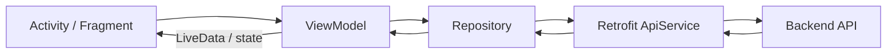

# Kiến trúc Android

> Trạng thái: authoritative. Room/SQLite không thuộc kiến trúc runtime hiện tại.

Ứng dụng theo MVVM với đường đi chuẩn:

## Các lớp chính

- UI render state, thu input và gửi intent cho ViewModel.
- ViewModel giữ state qua thay đổi cấu hình, gọi Repository và chuẩn hóa lỗi.
- Repository là biên dữ liệu cho auth, transaction, category, statistics,
  budget, goal, receipt, reminder và report.
- `ApiService` là contract Retrofit dùng JSON hoặc multipart.
- `ApiClient` gắn access token và `RefreshTokenAuthenticator`.
- `TokenStore` lưu token bằng AndroidX Security encrypted preferences.

## Dữ liệu cục bộ được phép

Android chỉ giữ dữ liệu vận hành tối thiểu: token pair mã hóa; receipt draft
gồm ID, phase, URI/file tạm và idempotency key; alarm metadata theo user; và
tùy chọn UI. Đây không phải bản sao authoritative của dữ liệu nghiệp vụ. Khi
login, resume hoặc boot, reminder được đồng bộ lại từ backend.

## Receipt và process death

Upload/process là bất đồng bộ. `202 Accepted` chỉ có nghĩa đã queue. ViewModel
persist draft, polling và tiếp tục sau rotation/process death. Khi hủy/chụp lại,
UI gọi DELETE receipt; app không tự xóa ảnh chỉ vì đóng màn hình.

## Pagination và tiền

- Transaction dùng `page/pageSize`; Home lấy tổng tháng từ statistics API.
- Backend sắp xếp ổn định theo `transaction_date`, `created_at`, `id`.
- VND trong domain/DTO dùng `long`; float chỉ được dùng tại biên vẽ biểu đồ.

## Release configuration

Debug emulator dùng `http://10.0.2.2:8080/`. Release lấy URL từ
`-PbackendUrl=https://...` hoặc `BACKEND_BASE_URL`; build release bị từ chối
nếu URL không phải HTTPS.

