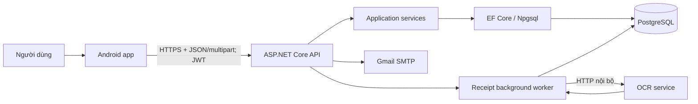

# Tổng quan hệ thống Expense Manager

> Trạng thái: authoritative cho phiên bản backend API + PostgreSQL hiện tại.

Hệ thống quản lý thu/chi, danh mục, ngân sách, mục tiêu tiết kiệm, nhắc nhở,
báo cáo và nhập giao dịch từ ảnh hóa đơn. Android không có database nghiệp vụ
cục bộ: dữ liệu chính được xử lý bởi backend và lưu trong PostgreSQL.

## Thành phần và trách nhiệm

| Thành phần | Trách nhiệm |
|---|---|
| Android | UI, ViewModel, gọi API qua Repository, lưu token mã hóa, draft receipt và alarm metadata theo user |
| ASP.NET Core API | Auth, kiểm tra quyền sở hữu, validation, nghiệp vụ, idempotency, concurrency, xuất báo cáo |
| Receipt worker | Claim job PostgreSQL, gọi OCR nội bộ, retry/lease và cập nhật trạng thái |
| PostgreSQL | Nguồn dữ liệu duy nhất cho nghiệp vụ, session và toàn bộ byte ảnh receipt |
| OCR service | Nhận byte ảnh từ backend và trả kết quả OCR; Android không gọi trực tiếp |
| Gmail SMTP | Gửi mã đặt lại mật khẩu và mã xác nhận đổi email |

## Luồng dữ liệu chính

CRUD tài chính đi theo Android UI → ViewModel → Repository → Retrofit →
Controller → service/EF Core → PostgreSQL. Phản hồi đi ngược lại dưới dạng DTO.
Tiền VND là số nguyên `long`/`bigint`, không dùng `double` để lưu giá trị tiền.

### Receipt

1. Android upload multipart với `Idempotency-Key`; backend ghi metadata và byte
   ảnh vào cùng PostgreSQL.
2. Android gọi `POST /api/receipts/{id}/process`; API chuyển sang `QUEUED` và
   trả `202 Accepted` ngay.
3. Worker claim job bằng row lock, đặt lease và gọi OCR qua Docker network.
4. Worker ghi `REVIEW_REQUIRED`, hoặc retry rồi `OCR_FAILED`; job hết lease
   được reclaim sau crash/restart.
5. Android polling trạng thái. Người dùng sửa/xác nhận; `OCR_FAILED` vẫn có thể
   nhập tay khi form hợp lệ.
6. Xóa receipt là hành động rõ ràng. Receipt đã sinh transaction không được xóa.

### Auth/session

Access token sống 15 phút; refresh token sống 30 ngày, có rotation và revoke.
Android lưu token pair bằng encrypted preferences. Authenticator refresh
single-flight, retry request một lần rồi phát session-expired nếu vẫn lỗi.

## Ranh giới triển khai

- Backend là cổng public duy nhất cho Android.
- OCR chỉ có địa chỉ nội bộ `http://ocr-service:8000` trong Docker network.
- Upload mới không phụ thuộc `receipt-storage`; volume đó chỉ đọc ảnh legacy.
- VAT giữ nguyên theo contract hiện hữu.
