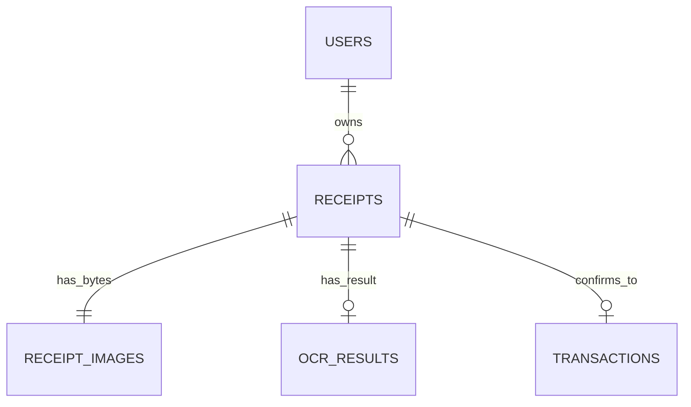

# PostgreSQL, ảnh receipt và vận hành

> Trạng thái: authoritative. PostgreSQL là nguồn dữ liệu lâu dài duy nhất.

## Ảnh được lưu ở đâu

Ảnh upload mới nằm trong bảng `receipt_images`, cột `data` kiểu PostgreSQL
`bytea`. Bảng có quan hệ một-một với receipt; tên file, MIME type, kích thước và
trạng thái nằm trên receipt. `GET /api/receipts/{id}/image` đọc byte từ
PostgreSQL và stream sau khi kiểm tra owner.



Upload mới không ghi filesystem/volume. `receipt-storage` trong Compose chỉ là
mount read-only để importer đọc ảnh phiên bản cũ. Migration chỉ bỏ `file_path`
sau khi import và xác minh thành công.

## Vòng đời và xóa

- Không có retention job tự xóa ảnh.
- Chỉ xóa khi người dùng gọi DELETE receipt.
- Receipt đã tạo transaction không được xóa.
- Không chạy `docker compose down -v` nếu chưa backup: lệnh đó xóa volume
  PostgreSQL, tức xóa cả metadata lẫn byte ảnh.

## Dung lượng

`bytea` dùng dung lượng volume `postgres-data`; giới hạn thực tế là disk cấp cho
Docker/host, không phải quota cố định của volume. Cần theo dõi database, WAL và
backup. Request upload hiện giới hạn khoảng 11 MiB và backend còn validate ảnh.

## Backup

```powershell
.\scripts\backup-postgres.ps1
```

Script dùng `pg_dump -Fc`, tạo `.dump` và SHA-256 dưới `backups/postgres`.
Custom format chứa cả metadata và `bytea`. Mặc định giữ 14 ngày artifact; dọn
file backup không xóa database live.

## Restore kiểm thử

Không restore đè production để thử. Dùng database riêng:

```powershell
.\scripts\restore-postgres.ps1 `
  -DumpFile backups/postgres/expense-manager-YYYYMMDD-HHMMSS.dump `
  -Database expense_manager_restore_test `
  -DropAndCreate
```

Script kiểm checksum trước `pg_restore`. Sau restore, so sánh metadata, số ảnh,
kích thước và hash byte:

```sql
SELECT count(*) FROM receipts;
SELECT count(*), sum(octet_length(data)) FROM receipt_images;
SELECT receipt_id, md5(data) FROM receipt_images ORDER BY receipt_id LIMIT 10;
```

## Migration ownership

Chỉ backend/schema-owner được sửa entity, `DbContext`, migration và snapshot.
Không sửa migration đã chạy production. CI kiểm pending model changes để phát
hiện model thay đổi nhưng thiếu migration.

